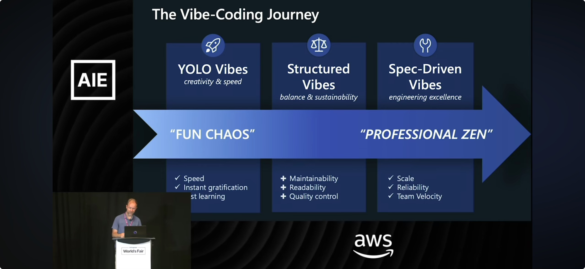

# Copilot Spec-driven Development (SDD) Templates

Templates for injecting shared .github and .vscode assets into an existing project, designed to work with Copier and MCP-powered workflows.

## Table of contents

- 🚀 Quick start: Apply now — [Apply to an existing project with Copier](#apply-to-an-existing-project-with-copier)
- [What is Spec-Driven Development (SDD)?](#what-is-spec-driven-development-sdd)
- [Transition from Vibe to Smart Coding using SDD](#transition-from-vibe-to-smart-coding-using-sdd-harald-kirchners-continuum)
- [What this repo contains](#what-this-repo-contains)
- [Available templates](#available-templates)
- [Prerequisites](#prerequisites)
- [Apply to an existing project with Copier](#apply-to-an-existing-project-with-copier)
  - [Preview (dry run)](#preview-dry-run)
  - [Apply changes](#apply-changes)
- [How common assets are applied](#how-common-assets-are-applied)
- [Updating shared content](#updating-shared-content)
- [Troubleshooting](#troubleshooting)
- [Notes](#notes)
- [References](#references)

## What is Spec‑Driven Development (SDD)?

Spec‑Driven Development is a lightweight, “spec‑first” practice: write a clear, structured specification before you write code, and let that spec drive planning, design, implementation, review, and validation. In AI‑native teams this becomes an **intent → spec → autocode** loop: humans define the spec, agents plan/execute, and results feed back into the spec. The spec is the single source of truth for the team and for tools.

### Why now (AI‑native)

- **English is the new substrate** for orchestration, but it’s fuzzy — SDD adds constraints, guardrails, and interfaces so agents behave predictably.
- **Treat specs/prompts like code**: version them, observe runs, and attach evals/tests so delegation stays safe and repeatable.

### Why teams use SDD

- **Clarity and alignment** — fewer ambiguities and faster decisions
- **Traceability** — requirements map cleanly to designs, tasks, and tests
- **Smoother reviews** — concrete artifacts make PRs and change discussions easier
- **Faster onboarding and repeatability** — specs capture context so work scales
- **Safer AI automation** — AI agents can execute against explicit intent, not vibes

### How it fits with other practices

- **Complements TDD/BDD** — SDD clarifies what to build; TDD/BDD verify behavior and correctness
- **Works with iterative delivery** — specs evolve; changes are reflected in design and tasks, keeping the loop tight
- **Agent‑compatible** — specs + evals + guardrails enable reliable delegation to coding/orchestration agents

## Transition from Vibe to Smart Coding using SDD (Harald Kirchner’s continuum)

### Teams evolve along a continuum

[](https://www.youtube.com/watch?v=1DlNVROQ6DI)

- **YOLO Vibes** — “fun chaos”
  - Speed, instant gratification, fast learning
- **Structured Vibes** — balance & sustainability
  - Maintainability, readability, quality control
- **Spec‑Driven Vibes** — “professional zen” and engineering excellence
  - Scale, reliability, team velocity

This repo helps you move rightward on that continuum by injecting opinionated `.github` and `.vscode` assets plus chatmodes and MCP configs that encourage writing specs, reviewing changes, and automating routine steps.

<!-- References moved to bottom -->

## What this repo contains

- Multiple project templates under `templates/`
- A `common/` directory with shared assets that get injected into each template during generation:
  - `common/.github/{instructions,prompts,chatmodes}`
  - `common/.vscode/*`
- A root `copier.yml` that selects a template subdirectory and propagates common assets (README.md files in `common/` are excluded from copy)

## Available templates

- `templates/beastmode` — agent-focused scaffold with Beast Mode chatmodes and VS Code settings
- `templates/gha` — GitHub Actions workflows and shared CI scaffolding
- `templates/gist` — lightweight scaffold (docs/snippets oriented)
- `templates/plan` — planning and architecture scaffold for specs, roadmaps, and reviews
- `templates/prompt` — prompt-engineering oriented scaffold and Copilot chat assets
- `templates/sst` — Serverless Stack (SST) development scaffold
- `templates/typescript` — general TypeScript project scaffold

### Create a new template (maintainer utility)

To scaffold a new template directory (including the current shared chatmodes) run from the repo root:

```zsh
copier copy --trust internal/new-template .
```

Answer the prompts (`template_name`, `template_slug`, and a derived `final_slug` preview). A new directory will appear at `templates/<final_slug>/` with:

- `.github/chatmodes/` populated from `common/.github/chatmodes/` (snapshot at creation time)
- Empty `.github/instructions`, `.github/prompts`, and `.vscode/mcp` folders ready for overrides
- A starter `README.md`

Add any additional scaffold files you want this template to provide (package manifests, config, etc.). When end users run the **root** template, shared assets from `common/` will still be injected on top of what the new template supplies.

If you later update shared chatmodes and want the new template’s snapshot refreshed, re-run the scaffold (it will not overwrite existing files unless you remove them first) or manually copy changes (the scaffold copies, it does not symlink).

Note: `--trust` is required because the internal scaffold uses Copier tasks to create folders and copy chatmode files; without it, tasks are blocked.

> Tip: Each template may include its own `.github` and `.vscode` folders to override or extend the common assets.

### Update existing templates with latest common assets (maintainer utilities)

When you change shared assets under `common/` (chatmodes, instructions, prompts, or any files under `.vscode/`) you can refresh the snapshot inside one or all template directories using internal Copier utilities (no standalone script required).

Update a single template:

```zsh
copier copy --trust internal/update-template .
```

Prompts:

- `target_template` (e.g. `gist`, `sst`, `typescript`)
- Toggle asset groups: chatmodes, instructions, prompts, mcp
- Overwrite mode: `overwrite` (default) vs `skip`

Behavior:

- Uses `rsync` to merge common assets into template directories.
- Excludes `README.md` files from common (same as root generation behavior).

These utilities keep template directories in sync for inspection or cloning; end users always receive the latest shared assets at generation via the root `copier.yml`.

## Prerequisites

- Homebrew (macOS)
- Copier (via Homebrew)

```zsh
# Install Homebrew if you need it: https://brew.sh
brew update
brew install copier
```

## Apply to an existing project with Copier

> Start here if you want to integrate these assets into an existing repo. The commands below are copy‑paste ready for macOS zsh.

This repository is meant to be applied to an existing project (not to start a new one). Run Copier from your existing project root and use `.` as the destination.

### Preview (dry run)

```zsh
# From your existing project root
copier copy --pretend "gh:chandima/copilot-sdd-templates" .
```
What happens:
- If you have NOT applied this template before (no `.copier-answers.yml` yet), Copier will prompt you for `template_name`.
- If a previous run stored an answer, it will reuse it silently (so you might NOT see a prompt).

Available template names (directory names under `templates/`):
- beastmode
- gha
- gist
- plan
- prompting
- sst
- typescript

Non-interactive (explicit template, reproducible & CI‑friendly):

```zsh
copier copy --pretend --data template_name=sst "gh:chandima/copilot-sdd-templates" .
```

Need to force a new prompt? Delete or edit `.copier-answers.yml` first, then rerun the dry run without `--data`.

### Apply changes

Run non-interactively by specifying the template explicitly (recommended for reproducibility):

```zsh
copier copy --data template_name=sst "gh:chandima/copilot-sdd-templates" .
```

If you omit `--data template_name=...` and no existing `.copier-answers.yml` contains a value, Copier will prompt you for `template_name`.

What happens:

- Copier writes a `.copier-answers.yml` in your project to record choices.
- Common assets and the chosen template’s files are merged into your repo.
- Existing files are respected per template rules (e.g., `skip_if_exists`), and common `README.md` files are not copied.
- Commit your repo before applying, then review the diff after.

## How common assets are applied

- During generation, common assets from `common/.github/*` and `common/.vscode/*` are copied into the output project.
- `README.md` files inside `common/` are intentionally NOT copied (to avoid overwriting your project README).
- Template-specific files take precedence if they define the same paths.

Tip: After the first apply, you can bring in updates later using `copier update` from your project root.

## Updating shared content

- Edit files under `common/.github/*` or `common/.vscode/*`.
- From your project root, run `copier update` to pull in changes while respecting your local edits.
- Because template-specific files can override common files, review diffs when updating.

Advanced:

- If you need to re-apply the template ignoring project history (not usually recommended), use `copier recopy` and resolve any conflicts, then commit.

## Troubleshooting

- If Copier doesn't prompt for `template_name`, ensure you're pointing at this repo (the template source) and running from your project root with `.` as destination.
- If your Copier version doesn't support certain features, upgrade:

```zsh
brew upgrade copier
```

- If common assets don't appear, check the root `copier.yml` in this repo and your Copier version, then re-run the apply or update.

## Notes

- Commands above are written for macOS zsh.
- MCP-related configurations live under `.vscode/mcp` (alongside any other shared VS Code settings) and `.github/chatmodes`/`prompts`/`instructions`.

## References

- Age of the Spec — https://www.linkedin.com/pulse/age-spec-shyamal-hitesh-anadkat-3j9vc/
- YouTube: The SDD journey and vibe‑coding continuum — https://www.youtube.com/watch?v=1DlNVROQ6DI
- YouTube: Hands‑on agentic workflows with specs and MCP — https://www.youtube.com/watch?v=eOxOzcw70f0
- About Model Context Protocol (MCP) — https://docs.github.com/en/copilot/concepts/about-mcp
- Extend Copilot Chat with MCP — https://docs.github.com/copilot/customizing-copilot/using-model-context-protocol/extending-copilot-chat-with-mcp
- Using the GitHub MCP Server — https://docs.github.com/en/copilot/how-tos/provide-context/use-mcp/use-the-github-mcp-server
- Enhance Copilot agent mode with MCP — https://docs.github.com/en/copilot/tutorials/enhance-agent-mode-with-mcp
