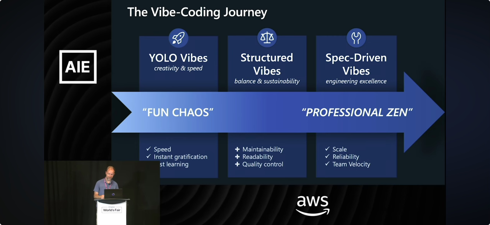

## Spec-Driven Development (SDD)

Spec-Driven Development is a lightweight, "spec-first" practice: write a clear, structured specification before you write code, and let that spec drive planning, design, implementation, review, and validation.
In AI-native teams this becomes an **intent → spec → autocode** loop: humans define the spec, agents plan/execute, and results feed back into the spec.
The spec is the single source of truth for the team and for tools.

## Why Now (AI-Native)

- **English is the new substrate** for orchestration, but it's fuzzy — SDD adds constraints, guardrails, and interfaces so agents behave predictably.
- **Treat specs/prompts like code**: version them, observe runs, and attach evals/tests so delegation stays safe and repeatable.

## Benefits

- **Clarity and alignment** — fewer ambiguities and faster decisions
- **Traceability** — requirements map cleanly to designs, tasks, and tests
- **Smoother reviews** — concrete artifacts make PRs and change discussions easier
- **Faster onboarding and repeatability** — specs capture context so work scales
- **Safer AI automation** — AI agents can execute against explicit intent, not vibes

## Relation to Other Practices

- **Complements TDD/BDD** — SDD clarifies what to build; TDD/BDD verify behavior and correctness
- **Works with iterative delivery** — specs evolve; changes are reflected in design and tasks, keeping the loop tight
- **Agent-compatible** — specs + evals + guardrails enable reliable delegation to coding/orchestration agents

## Evolution Continuum

### Teams evolve along a continuum

- **YOLO Vibes** — "fun chaos"
  - Speed, instant gratification, fast learning
- **Structured Vibes** — balance & sustainability
  - Maintainability, readability, quality control
- **Spec-Driven Vibes** — "professional zen" and engineering excellence
  - Scale, reliability, team velocity

This continuum illustrates the natural progression teams experience as they mature their development practices. Moving rightward along this spectrum brings increasing levels of predictability, scalability, and team velocity—especially important when working with AI agents and automation.

## Applying SDD with These Templates

The templates in this repository help you adopt SDD by providing:

- **Structured specifications** — write specs before code using consistent formats
- **Regenerating and updating shared assets** — maintain consistency across projects with Copier
- **Mapping specs to tests and agent tasks** — clear traceability from intent to implementation
- **Chatmodes and prompts** — AI-powered assistance that understands and respects your specs
- **MCP configurations** — Model Context Protocol integration for enhanced agent capabilities

By injecting opinionated `.github` and `.vscode` assets plus chatmodes and MCP configs, these templates encourage writing specs, reviewing changes, and automating routine steps—helping you move rightward on the vibe-coding continuum.

For detailed usage instructions, see the main [README](../README.md).

## References

- Age of the Spec — https://www.linkedin.com/pulse/age-spec-shyamal-hitesh-anadkat-3j9vc/
- YouTube: The SDD journey and vibe-coding continuum — https://www.youtube.com/watch?v=1DlNVROQ6DI
- YouTube: Hands-on agentic workflows with specs and MCP — https://www.youtube.com/watch?v=eOxOzcw70f0
- About Model Context Protocol (MCP) — https://docs.github.com/en/copilot/concepts/about-mcp
- Extend Copilot Chat with MCP — https://docs.github.com/copilot/customizing-copilot/using-model-context-protocol/extending-copilot-chat-with-mcp
- Using the GitHub MCP Server — https://docs.github.com/en/copilot/how-tos/provide-context/use-mcp/use-the-github-mcp-server
- Enhance Copilot agent mode with MCP — https://docs.github.com/en/copilot/tutorials/enhance-agent-mode-with-mcp

---

Return to the main [README](../README.md) for usage and application instructions.
