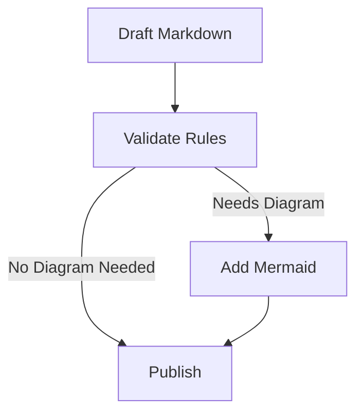

## Markdown Content Rules

The following markdown content rules are enforced in the validators:

1. **Headings**: Use an H1 at the top for the gist title (recommended), then H2/H3 for sections. Keep a clear hierarchy.
2. **Lists**: Use bullet points or numbered lists for lists. Ensure proper indentation and spacing.
3. **Code Blocks**: Use fenced code blocks for code snippets. Specify the language for syntax highlighting.
4. **Links**: Use proper markdown syntax for links. Ensure that links are valid and accessible.
5. **Images**: Use proper markdown syntax for images. Include alt text for accessibility.
6. **Tables**: Use markdown tables for tabular data. Ensure proper formatting and alignment.
7. **Line Length**: Prefer ≤120 characters per line for readability. Long URLs may exceed this.
8. **Whitespace**: Use appropriate whitespace to separate sections and improve readability.
9. **Front Matter**: Do not include YAML front matter in gists. Use the Gist Description field instead.

### Context7 Integration (Markdown + Mermaid)

Use Context7 to fetch up-to-date syntax and best practices when writing or validating Markdown and Mermaid content.

- When users request documentation, examples, or syntax help, automatically use Context7.
- Prefer targeted docs retrieval for:
  - Mermaid: resolve and fetch docs for the Mermaid library (e.g., use library id like `/mermaid-js/mermaid` if available).
  - Markdown: when needed, pull docs for commonly used Markdown engines or specs (e.g., `markdown-it`, `mdx`, or related CommonMark/GFM resources available via Context7).
- Tools and parameters:
  - `resolve-library-id` with `libraryName` set to "mermaid", "markdown-it", or "mdx".
  - `get-library-docs` with `context7CompatibleLibraryID` and optional `topic` such as "syntax", "diagrams", or "extensions". Keep `tokens` at default.
- Fast paths:
  - If you already know the library id, add: use library /mermaid-js/mermaid
  - Otherwise: use context7 and resolve the id first.

Authoring guidance with Mermaid:

- Use Mermaid code blocks for architecture, flows, timelines, and sequences when a diagram improves clarity.
- Ensure Mermaid syntax aligns with latest docs (flowchart TD/LR, sequenceDiagram, classDiagram, stateDiagram-v2, erDiagram, gantt, etc.).
- Keep diagrams small and focused; prefer labels over long node text.
- Provide a short caption beneath the diagram describing its intent.

## Formatting and Structure

Follow these guidelines for formatting and structuring your markdown content:

- **Headings**: Use `##` for H2 and `###` for H3. Ensure that headings are used in a hierarchical manner. Recommend restructuring if content includes H4, and more strongly recommend for H5.
- **Lists**: Use `-` for bullet points and `1.` for numbered lists. Indent nested lists with two spaces.
- **Code Blocks**: Use triple backticks (`) to create fenced code blocks. Specify the language after the opening backticks for syntax highlighting (e.g., `csharp).
- **Links**: Use `[link text](URL)` for links. Ensure that the link text is descriptive and the URL is valid.
- **Images**: Use `` for images. Include a brief description of the image in the alt text.
- **Tables**: Use `|` to create tables. Ensure that columns are properly aligned and headers are included.
- **Line Length**: Aim for ≤120 characters per line. Use soft line breaks; do not break URLs.
- **Whitespace**: Use blank lines to separate sections and improve readability. Avoid excessive whitespace.

### GitHub Gist specifics

- No YAML front matter. Place any metadata in the Gist Description (outside the file).
- Use a descriptive filename ending in `.md` (e.g., `postgres-backup-notes.md`).
- Keep the Gist Description concise (≤120 chars) and action-oriented.
- Prefer public gists for shareable content; never include secrets or sensitive data.
- Gists render with GitHub Flavored Markdown (GFM): task lists, tables, autolinks, strikethrough, emoji, and Mermaid are supported.
- If using Mermaid, include a short caption under the diagram.

### Markdown and Mermaid Usage Rules

- Prefer Markdown for structure (headings, lists, tables) and Mermaid for visual relationships.
- Mermaid blocks must be fenced with ```mermaid and be valid according to current Mermaid syntax.
- Use tables or definition lists for structured reference data; use Mermaid for flows and relationships.
- When converting complex lists of steps, consider a Mermaid flowchart alongside the list.

Example Mermaid block:


_Diagram: Authoring flow for Markdown with Mermaid validation._

## Validation Requirements

Ensure compliance with the following validation requirements:

- **Gist Metadata**:
  - Description is present and concise (≤120 chars), summarizing the content.
  - Filename is descriptive and ends with `.md`.
  - Visibility is appropriate (public unless sensitive/private).
  - No YAML front matter present in the file.
  - No secrets, tokens, or credentials included.

- **Content Rules**: Ensure that the content follows the markdown content rules specified above.
- **Formatting**: Ensure that the content is properly formatted and structured according to the guidelines.
- **Validation**: Preview in GitHub Gist to confirm GFM features (tables, task lists) and Mermaid diagrams render correctly.

### Context7 Validation Checklist

Before finalizing content that uses Markdown/Mermaid:

- [ ] If syntax questions arise, fetched relevant docs via Context7.
- [ ] Confirm Mermaid diagrams render per latest Mermaid grammar.
- [ ] Any library-specific features (MDX, GFM tables, admonitions) are supported by the target renderer.
