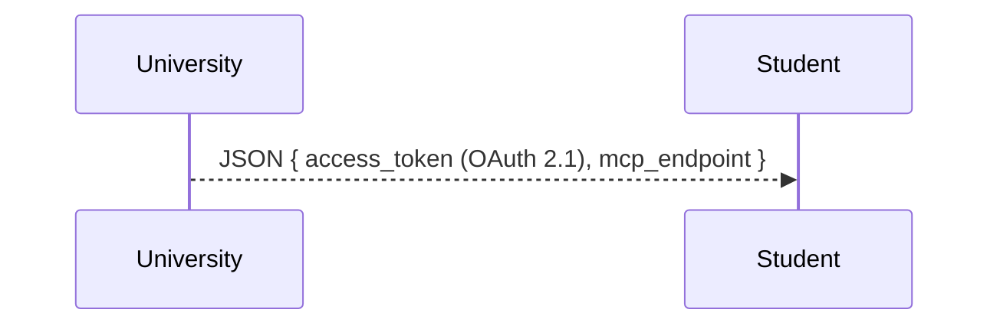
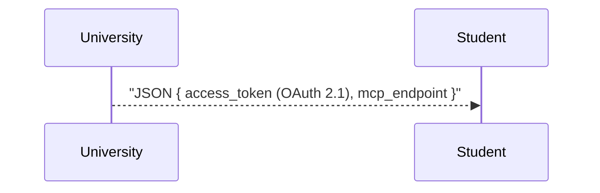
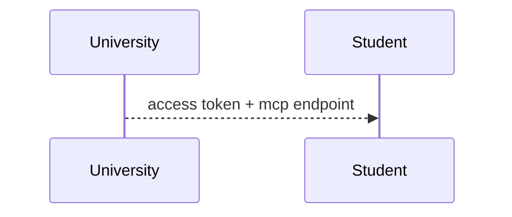
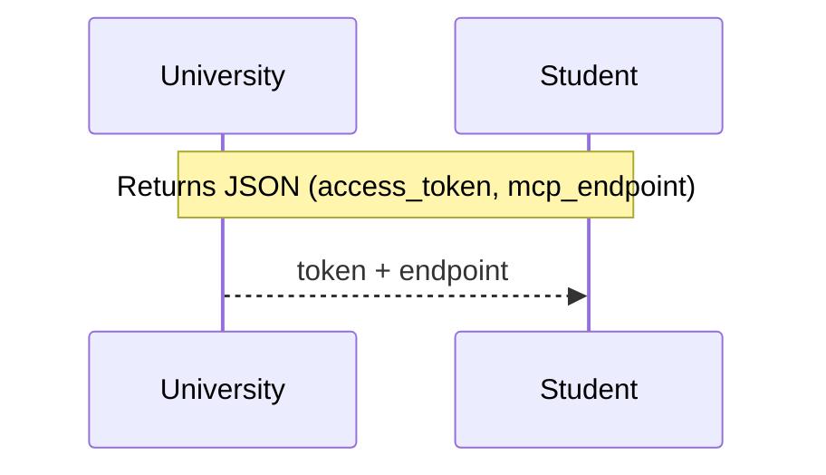

You are assisting with diagnosing and fixing a Mermaid diagram.

Provide a precise task definition including:

1. Current diagram (raw mermaid code block) and the observed issue(s) (e.g., syntax error, layout overlap, missing nodes, rendering differences between GitHub and Mermaid Chart).
2. Desired outcome (what the corrected diagram should express semantically: flow, sequence, dependency, state, or architecture).
3. Constraints:
	- Keep node identifiers stable where possible to minimize downstream diff noise.
	- Prefer officially supported Mermaid syntax (https://mermaid.js.org) and avoid experimental directives unless required.
	- Optimize for readability: left-to-right if flow clarity improves, concise labels, consistent casing.
	- If graph is complex (> ~25 nodes) propose decomposition (subgraphs or multiple diagrams).
4. Validation criteria (e.g., “renders in GitHub Markdown and Mermaid Chart preview with no warnings”, “no label truncation”, “edges unambiguous”).

Tooling (Context7 docs + Mermaid MCP validation/render):

- Use the Context7 `mermaidchart` library (https://context7.com/websites/mermaidchart) for authoritative syntax and feature lookups.
- Use the `mermaid` MCP server to programmatically validate and render diagrams. Typical operations (exact method names may differ; adapt to server introspection):
  - mermaid.validate(code) → returns { ok: bool, errors: [ { line, column, message } ] }
  - mermaid.render(code, format=svg) → returns { format, data(base64)|path }
  - (Optional) mermaid.ast(code) → structural representation (if supported) for deeper diffing.

For each fix cycle you should:
	1. Query the tool for the specific construct (e.g., "sequenceDiagram activation", "classDiagram generics", "flowchart subgraph nesting") and retrieve the authoritative snippet.
	2. Run mermaid.validate on the current snippet; record errors/warnings (attach line + message table).
	3. Compare retrieved canonical syntax against the provided diagram; list deltas (missing arrows, malformed edge labels, invalid keywords).
	4. Incorporate only necessary changes; avoid rewriting stylistically correct sections.
	5. If a feature is unsupported per tool response, propose an alternative representation (e.g., switch from `stateDiagram` to `flowchart` with annotated nodes).
	6. Cite (briefly) which retrieved construct(s) informed the fix (e.g., "Edge label format per mermaidchart: flowchart linkStyle syntax").
	7. Re-run mermaid.validate after changes to ensure the revised code has no reported issues; if successful optionally call mermaid.render to confirm visual generation.
  
If the tool returns multiple variants, prefer the most recent stable syntax it marks or, if ambiguous, choose the simplest form that renders across common Markdown renderers (GitHub / VS Code).

Example Mermaid parse error (simplified from a larger sequence diagram):

```
Error: Parse error on line 18:
...olicy/trust registry  U-->>S: JSON { ac
-----------------------^
Expecting 'SOLID_OPEN_ARROW', 'DOTTED_OPEN_ARROW', 'SOLID_ARROW', 'BIDIRECTIONAL_SOLID_ARROW', 'DOTTED_ARROW', 'BIDIRECTIONAL_DOTTED_ARROW', 'SOLID_CROSS', 'DOTTED_CROSS', 'SOLID_POINT', 'DOTTED_POINT', got 'NEWLINE'
```

Root cause: The message label after `U-->>S:` contains unquoted braces with a partial JSON payload (`JSON { access_token ... }`). The Mermaid sequenceDiagram lexer treats the `{` as the start of a token sequence it cannot parse as a valid arrow or continuation, producing a newline parse error at the brace boundary.

Minimal failing snippet:



Remedies (choose one):
1. Quote the entire payload label (simplest):

2. Simplify label (avoid braces):

3. Use a preceding Note for structured data, keep arrow concise:


Validation steps after applying a fix:
1. Run `mermaid.validate` with the corrected code; expect `ok: true` and empty `errors` array.
2. If `ok: true`, run `mermaid.render` (format=svg) to ensure an SVG is produced (no runtime warnings).
3. Visually inspect the rendered SVG (or open the path) to confirm:
	 - The message arrow renders once.
	 - The label text is intact (no truncation / wrapping anomalies).
4. (Optional) Re-run with alternative remedy (e.g., Note variant) if readability or wrapping in your target viewport is better; pick the version with clearer semantics and shorter horizontal span.
5. Record in the validation checklist: Parse Errors: Pass, Rendering: Pass, Label Clarity: Pass.

Heuristic: Prefer quoting when you only need to preserve literal braces; prefer a Note when the payload is verbose or might wrap awkwardly.

Response structure:

- Summary of detected issues.
- Corrected Mermaid code block.
- Optional alternatives (e.g., switch to flowchart LR, or split into two diagrams) with trade‑offs.
- Validation details:
	- Pre-fix errors (table)
	- Post-fix validation result (Pass/Fail)
	- Checklist mapping each success criterion to Pass / Needs Review

If original diagram is not provided, request it first (only once). If multiple error classes exist, address syntax blockers before stylistic improvements.

Be concise; focus on actionable corrections. Do not include unrelated commentary.
